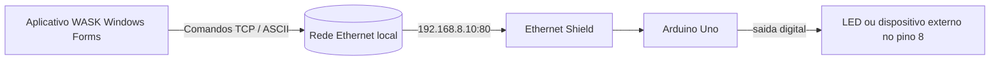
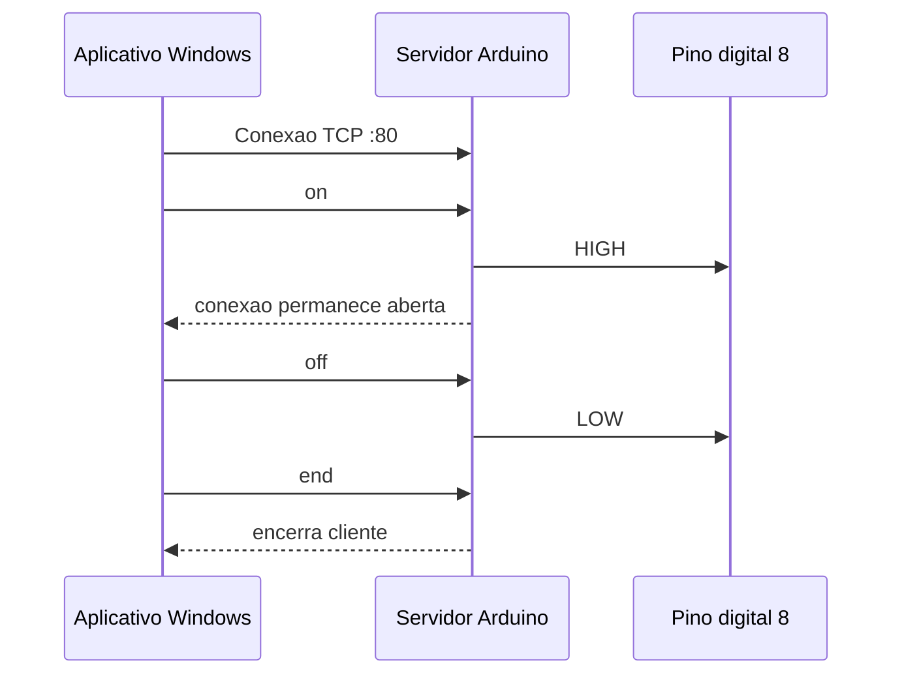

# WASK

> Um pequeno prototipo de IoT que conecta um aplicativo desktop para Windows a um Arduino Uno por meio de uma rede Ethernet local.

[](https://github.com/)
[](https://dotnet.microsoft.com/)
[](https://www.arduino.cc/)
[](#licenca)

O WASK e um experimento de controle de hardware pela rede. Um aplicativo Windows Forms abre uma conexao TCP com um Arduino Uno equipado com Ethernet Shield. O Arduino escuta comandos de texto simples e controla uma carga conectada ao pino digital 8.

## Como Funciona



O aplicativo atualmente tenta conectar em `192.168.8.20:80`, enquanto o sketch do Arduino esta configurado com o endereco estatico `192.168.8.10`. Os valores precisam ser iguais para que a conexao funcione. O rotulo informativo da tela ainda mostra `.10`; se outro endereco for escolhido, atualize esse rotulo tambem.

## Recursos

- Comunicacao TCP direta em uma rede local.
- Protocolo ASCII minimo: `on`, `off` e `end`.
- Controles Windows Forms para conectar, desconectar e alternar a saida.
- Suporte ao Ethernet Shield pelas bibliotecas padrao `SPI` e `Ethernet`.
- Base simples para controlar rele, lampada, sensor ou outro dispositivo de baixa tensao.

## Estrutura do Repositorio

| Caminho | Descricao |
| --- | --- |
| `Form1.cs` | Logica do ciclo de conexao e envio de comandos. |
| `Form1.Designer.cs` | Controles e layout do Windows Forms. |
| `Program.cs` | Ponto de entrada do aplicativo desktop. |
| `WASK.csproj` | Definicao do projeto .NET Framework 4.7.2. |
| `arduino/main/main.ino` | Servidor Ethernet e firmware de controle do pino. |
| `Properties/` | Metadados e recursos da aplicacao. |

## Requisitos

### Hardware

- Arduino Uno.
- Ethernet Shield ou modulo Ethernet compativel com Arduino.
- Cabo Ethernet e um roteador ou switch na mesma rede do computador.
- LED com resistor adequado para demonstracao, ou um circuito driver apropriado para o dispositivo escolhido.

> Nunca conecte um dispositivo ligado a rede eletrica diretamente a um pino do Arduino. Use um rele, transistor ou driver de motor dimensionado corretamente, com aterramento comum quando necessario.

### Software

- Windows com .NET Framework 4.7.2 ou superior instalado.
- Visual Studio com as ferramentas de desenvolvimento desktop .NET, ou outro ambiente MSBuild compativel.
- Arduino IDE com a biblioteca Ethernet disponivel.

## Montagem Eletrica

Para um teste simples com LED:

1. Conecte o pino digital 8 ao anodo do LED por meio de um resistor limitador de corrente.
2. Conecte o catodo do LED ao `GND`.
3. Encaixe o Ethernet Shield no Uno e conecte-o ao roteador.

O firmware coloca o pino 8 em `HIGH` com o comando `on` e em `LOW` com o comando `off`.

## Configuracao

### 1. Configure o endereco do Arduino

Abra `arduino/main/main.ino` e escolha um endereco estatico livre na sua rede:

```cpp
IPAddress ip(192, 168, 8, 10);
EthernetServer server(80);
```

Carregue o sketch no Uno, conecte o shield ao roteador e abra o Monitor Serial em `9600` baud.

### 2. Configure o cliente desktop

Em `Form1.cs`, defina `enderecoIP` com o mesmo endereco usado no sketch:

```csharp
string enderecoIP = "192.168.8.10";
int porta = 80;
```

Se o endereco mudar, atualize tambem o rotulo informativo de IP em `Form1.Designer.cs`. O projeto mantem esses valores em pontos separados, portanto e importante deixa-los sincronizados.

### 3. Compile e execute

Abra `WASK.sln` no Visual Studio, selecione `Debug` ou `Release`, compile a solucao e execute o aplicativo. O executavel sera gerado em `bin/Debug/` ou `bin/Release/`.

## Uso do Aplicativo

1. Clique em **CONECTAR** para abrir a conexao TCP.
2. Clique em **LIGAR** para enviar `on` e colocar o pino 8 em HIGH.
3. Clique novamente no mesmo botao para enviar `off` e colocar o pino 8 em LOW.
4. Clique em **DESCONECTAR** para enviar `end` e fechar a conexao.

O aplicativo mostra uma mensagem quando a conexao e estabelecida, quando um comando e enviado ou quando ocorre um erro.

## Protocolo de Comandos

| Comando | Acao do aplicativo | Acao do Arduino |
| --- | --- | --- |
| `on` | Conectar ou ligar o dispositivo | Coloca o pino 8 em HIGH e escreve `OK` no Serial. |
| `off` | Desligar o dispositivo | Coloca o pino 8 em LOW. |
| `end` | Desconectar | Encerra o cliente Ethernet atual. |



## Solucao de Problemas

### O aplicativo nao consegue conectar

- Confirme que o computador e o Ethernet Shield estao na mesma sub-rede.
- Verifique se o IP em `main.ino` e igual a `enderecoIP` em `Form1.cs`.
- Confirme que a porta 80 esta acessivel e nao esta bloqueada pelo firewall do Windows.
- Verifique os LEDs de link/atividade do shield e se o roteador aceita o endereco escolhido.

### A conexao funciona, mas a saida nao muda

- Confirme que a carga esta conectada ao pino digital 8 e ao `GND`.
- Verifique se o sketch foi carregado na placa correta e se o Monitor Serial esta em `9600` baud.
- Teste primeiro com LED e resistor antes de conectar um rele ou outro dispositivo externo.

### O aplicativo informa que e necessaria uma conexao

Clique em **CONECTAR** antes. O botao de saida so envia comandos enquanto o cliente TCP esta conectado.

## Limitacoes Conhecidas

- O IP e a porta estao fixos no codigo, sem uma tela de configuracao.
- A comunicacao nao possui autenticacao e foi pensada apenas para uma rede local confiavel.
- O protocolo nao possui autenticacao, criptografia, tentativas automaticas ou tratamento estruturado de respostas.
- A implementacao do Arduino usa leituras bloqueantes e pausas, sendo um prototipo de aprendizado e nao um controlador de producao.
- O projeto usa .NET Framework 4.7.2 e Windows Forms tradicional.

## Melhorias Futuras

- Mover as configuracoes de rede para `App.config` ou para uma tela editavel.
- Adicionar delimitacao explicita de comandos e confirmacao para cada operacao.
- Substituir as pausas bloqueantes por temporizacao nao bloqueante.
- Adicionar timeout, reconexao e exibicao do estado real do dispositivo.
- Proteger o dispositivo com autenticacao ou um gateway seguro antes de usa-lo fora de uma LAN confiavel.

## Documentacao em Ingles

Consulte [README.md](README.md) para a versao em ingles.
