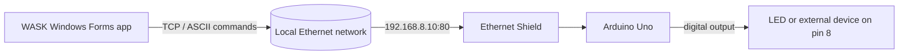
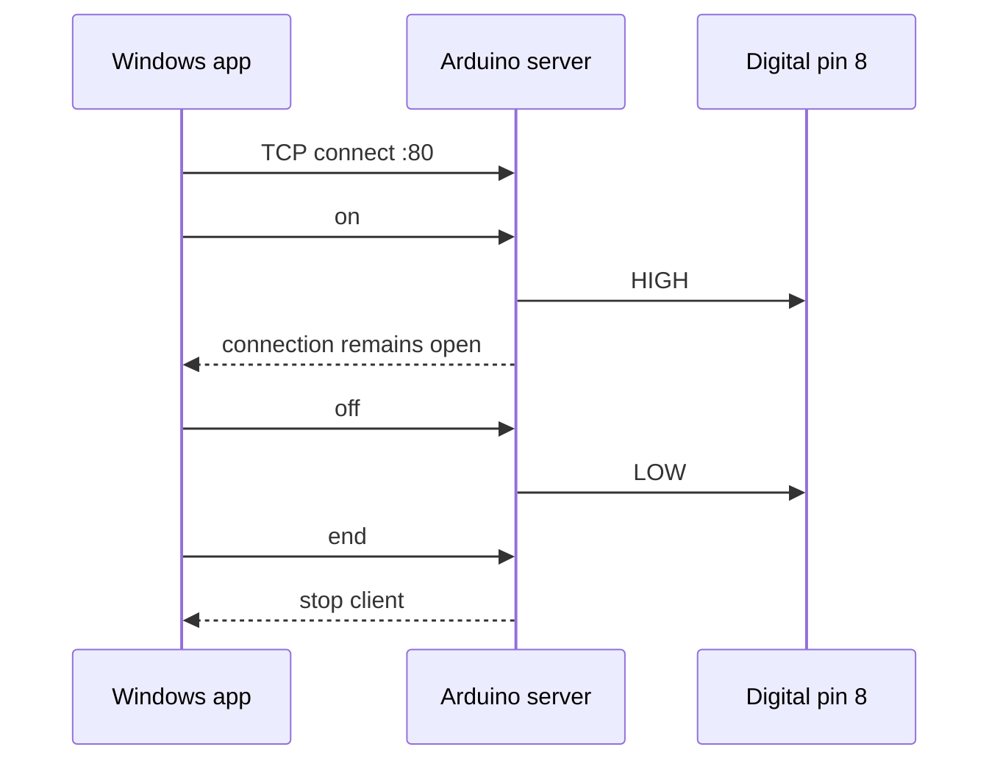

# WASK

> A small IoT proof of concept that connects a Windows desktop application to an Arduino Uno over a local Ethernet network.

[](https://github.com/)
[](https://dotnet.microsoft.com/)
[](https://www.arduino.cc/)
[](#license)

WASK is a compact network-controlled hardware experiment. A Windows Forms application opens a TCP connection to an Arduino Uno equipped with an Ethernet Shield. The Arduino listens for simple text commands and switches a load connected to digital pin 8.

## How It Works



The application currently targets `192.168.8.20:80`, while the Arduino sketch is configured with the static address `192.168.8.10`. These values must match before the application can connect. The form's informational label currently displays `.10`, so update the label as well if you choose another address.

## Features

- Direct TCP communication on a local network.
- Minimal ASCII command protocol: `on`, `off`, and `end`.
- Windows Forms controls for connecting, disconnecting, and toggling the output.
- Arduino Ethernet Shield support through the standard `SPI` and `Ethernet` libraries.
- A straightforward foundation for controlling relays, lamps, sensors, or other low-voltage devices.

## Repository Layout

| Path | Description |
| --- | --- |
| `Form1.cs` | Connection lifecycle and command-sending logic. |
| `Form1.Designer.cs` | Windows Forms controls and layout. |
| `Program.cs` | Desktop application entry point. |
| `WASK.csproj` | .NET Framework 4.7.2 project definition. |
| `arduino/main/main.ino` | Arduino Ethernet server and pin-control firmware. |
| `Properties/` | Application metadata and resources. |

## Requirements

### Hardware

- Arduino Uno.
- Arduino-compatible Ethernet Shield or Ethernet module.
- Ethernet cable and a router or switch on the same LAN as the computer.
- An LED with a suitable resistor for a safe demonstration, or an appropriate driver circuit for the target device.

> Do not connect a mains-powered device directly to an Arduino pin. Use a properly rated relay, transistor, or motor-driver circuit, with a common ground where required.

### Software

- Windows with .NET Framework 4.7.2 or later installed.
- Visual Studio with .NET desktop development tools, or another compatible MSBuild environment.
- Arduino IDE with the Ethernet library available.

## Hardware Wiring

For a basic LED test circuit:

1. Connect Arduino digital pin 8 to the LED anode through a current-limiting resistor.
2. Connect the LED cathode to `GND`.
3. Attach the Ethernet Shield to the Uno and connect it to the router.

The firmware sets pin 8 to `HIGH` for `on` and `LOW` for `off`.

## Setup

### 1. Configure the Arduino address

Open `arduino/main/main.ino` and set the static IP to an unused address on your LAN:

```cpp
IPAddress ip(192, 168, 8, 10);
EthernetServer server(80);
```

Upload the sketch to the Uno, connect the shield to the router, and open the Serial Monitor at `9600` baud.

### 2. Configure the desktop client

In `Form1.cs`, set `enderecoIP` to the same address configured in the sketch:

```csharp
string enderecoIP = "192.168.8.10";
int porta = 80;
```

If you change the address, update the informational IP label in `Form1.Designer.cs` too. The project currently contains these values in separate places, so keeping them synchronized is essential.

### 3. Build and run

Open `WASK.sln` in Visual Studio, select `Debug` or `Release`, build the solution, and run the application. The generated executable is placed under `bin/Debug/` or `bin/Release/`.

## Using the Application

1. Click **CONECTAR** to open the TCP connection.
2. Click **LIGAR** to send `on` and drive pin 8 HIGH.
3. Click the same button again to send `off` and drive pin 8 LOW.
4. Click **DESCONECTAR** to send `end` and close the client connection.

The application displays a message when the connection succeeds, when a command is sent, or when an error occurs.

## Command Protocol

| Command | Sender action | Arduino action |
| --- | --- | --- |
| `on` | Connect or turn the device on | Sets pin 8 HIGH and writes `OK` to Serial. |
| `off` | Turn the device off | Sets pin 8 LOW. |
| `end` | Disconnect | Stops the current Ethernet client. |



## Troubleshooting

### The application cannot connect

- Confirm that the computer and Ethernet Shield are on the same subnet.
- Verify the Arduino IP in `main.ino` matches `enderecoIP` in `Form1.cs`.
- Check that port 80 is reachable and not blocked by the Windows firewall.
- Confirm the shield has link/activity LEDs and that the router assigned or accepts the selected address.

### The connection works but the output does not change

- Confirm the load is connected to digital pin 8 and `GND`.
- Check that the sketch was uploaded to the correct board and that the Serial Monitor is set to `9600` baud.
- Test with an LED and resistor before attaching a relay or another external device.

### The application says a connection is required

Press **CONECTAR** first. The output button only sends commands while the TCP client is connected.

## Known Limitations

- The IP address and port are hard-coded rather than exposed in a settings screen.
- Communication is unauthenticated and intended for a trusted local network only.
- The protocol has no authentication, encryption, retries, or structured response handling.
- The Arduino implementation uses blocking reads and delays, so it is a learning prototype rather than a production controller.
- The project targets .NET Framework 4.7.2 and the classic Windows Forms stack.

## Future Improvements

- Move network settings to `App.config` or a user-editable configuration screen.
- Add explicit command framing and acknowledgements for every command.
- Replace blocking delays with non-blocking timing.
- Add connection timeouts, reconnection, and visible device state feedback.
- Protect the device behind authentication or a secure gateway before using it outside a trusted LAN.

## Portuguese Documentation

See [LEIAME.md](LEIAME.md) for the Portuguese version.